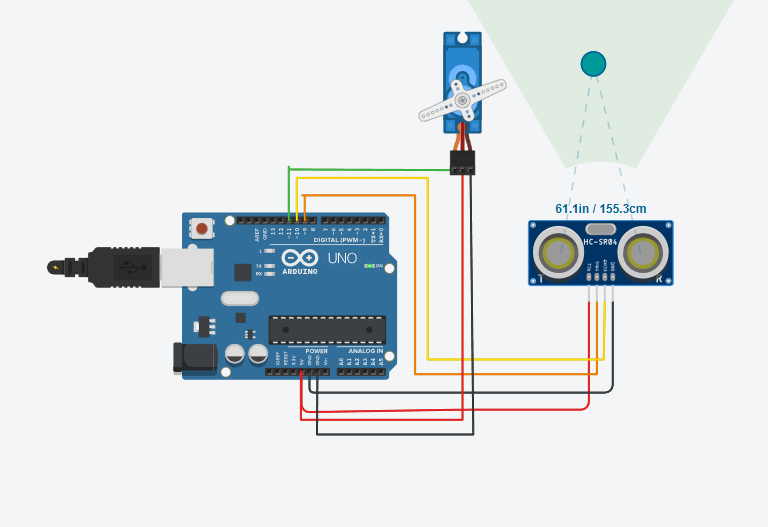
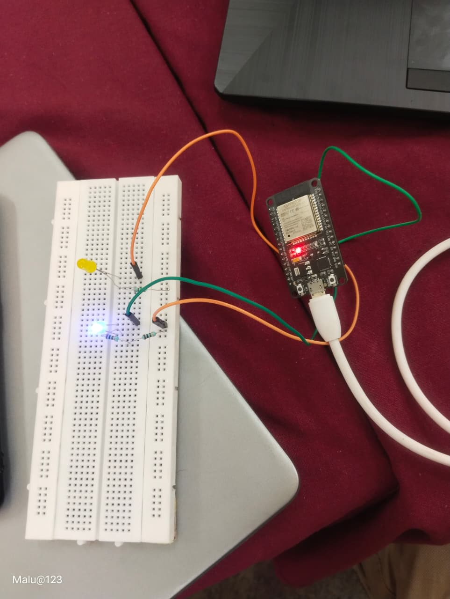
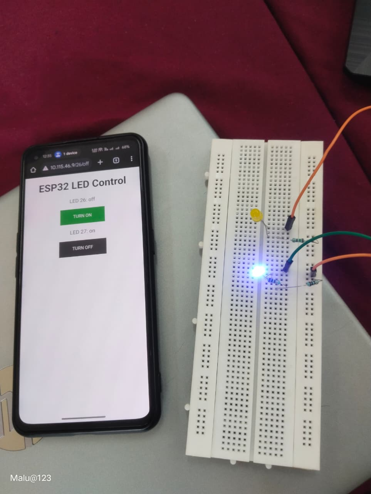
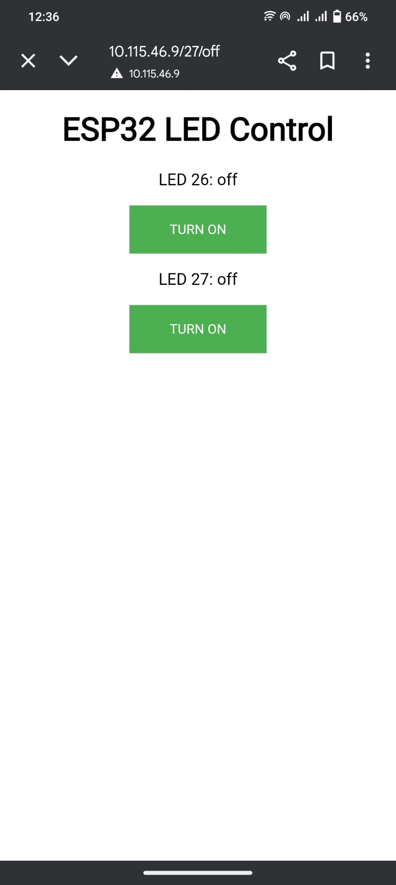
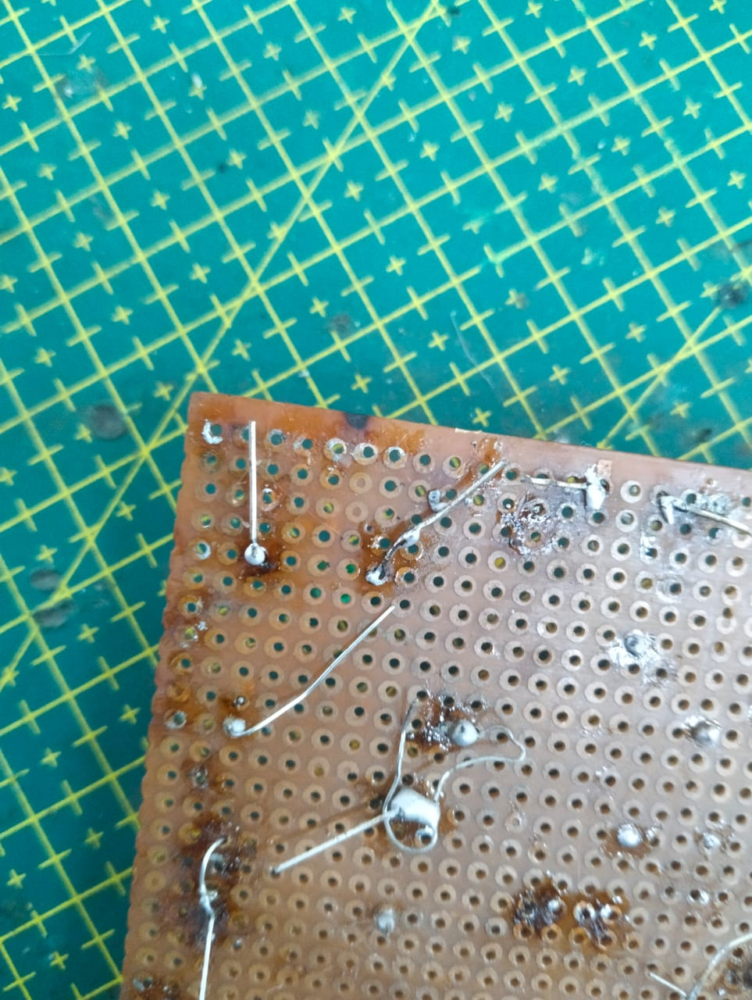
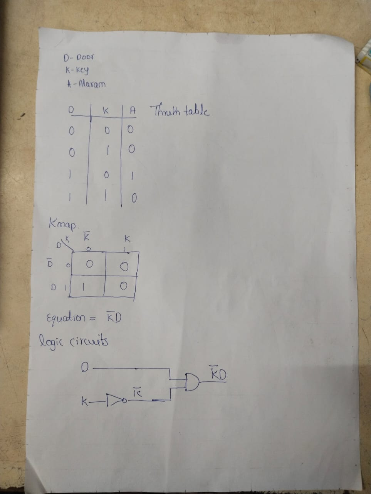
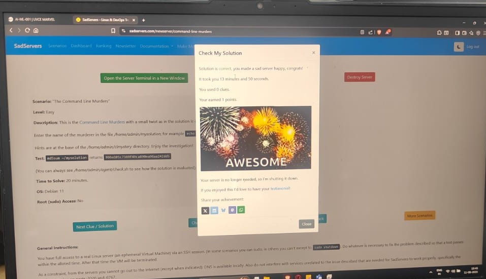

# TASK 2:API
An **API (Application Programming Interface)** is a bridge that allows two software systems to communicate and exchange data. It enables developers to access external services or data without building everything from scratch.

In my project, I used the **CoinGecko API** to fetch real-time cryptocurrency data such as **price, market cap, and coin details**. Since CoinGecko provides an **open API**, no API key is required. The data is returned in **JSON format** and displayed on the web app using **HTML, CSS, and JavaScript**.

Here is the link to my webpage that uses an API: [Crypto Price Tracker](https://anjan28052006.github.io/API/)


# TASK 3:Working with GitHub 

In this task i came to know about the working of GitHub like how to create the fork which basically means cloning the repositry and then about pull request  (PR) which  is a feature used in  GitHub to propose changes that we  made in others code repository so that they can review and merge them into the main branch 
       
And in this task we were asked to degub a basic python code which adds two numbers 

```
Step1: To fork the repositry
step2: Debug the python code which is inside the main.py
step3: pull request
```


[python_code_before](https://github.com/UVCE-Marvel/git-task/blob/main/main.py)  
[python_code_after](https://github.com/Anjan28052006/git-task-Marvel/blob/main/main.py)

# TASK 4:Get familiar with the command line on ubuntu and do the following subtasks

Here in this task I came to know about few unbuntu commands namely **pwd,mkdir,cd,ls,cat,touch** which were used to print the current working directory,create new directory,to change the working directory.to list the contents,To combine the contents between two files and to create the new file respectively 

```
mkdir test
cd test
touch file1
touch file2
echo "i am file 1" file1.txt
echo "i am file 2" file2.txt
cat file1.txt file2.txt
M{1...2600}
rm -r test
```


# TASK 7:Create a Portfolio Webpage

A portfolio is a collection of your work, skills, and achievements that showcases your abilities to potential employers, clients, or collaborators.I have created my portfolio using **HTML** and **CSS**.It contains some information such as about my self,education,hobbies,some basic projects,hobbies,skills and link to my social media accounts

below is the link for my portfolio webpage  
[Portfolio](https://anjan28052006.github.io/Portfolio/)

 # TASK 8:Writing Resource Article Using Markdown

 Here our aim is to write the technical resource article of our choice.  
My resource writing project is on **DataStructures** using **java** .Which conatins details regarding **Arrays,Linked List,Stack,Queue,Hashset,Trees and Graph**

Here is the link for resource article [Click Here](https://anjan28052006.github.io/Data-Structures-in-Java/)

# TASK 9:Tinkercard
This task is about to find the presnce of unknown object using ultrasonic sensor,servo meter and Arduino Uno

**Ultrasonic Sensor**:It has two heads called transmitter and receiver.Transmitter is used to send a sound waves which will bounce back on hitting any object and bounced back waves will be received by receiver


**Servo Meter**:It is used to rotate the ultrasonic sensor by 180 degree


**Ardunio**:Microcontroller board that controls the whole system

1) Sends a trigger signal to the ultrasonic sensor.
2) Calculates the distance based on the time taken for the echo.
3) Rotates the servo motor step by step from 0° to 180°.
4) Sends the calculated distance values to the Serial Monitor

Without Arduino, the ultrasonic sensor and servo wouldn’t know what to do.

Code:
```
#include <Servo.h>

const int trigPin = 9;
const int echoPin = 10;
const int servoPin = 11;

Servo radarServo;

void setup() {
  Serial.begin(9600);
  pinMode(trigPin, OUTPUT);
  pinMode(echoPin, INPUT);
  radarServo.attach(servoPin);
}

void loop() {
  for (int angle = 0; angle <= 180; angle += 2) {
    radarServo.write(angle);
    delay(100); // Allow servo to reach position

    long duration, distance;
    digitalWrite(trigPin, LOW);
    delayMicroseconds(2);
    digitalWrite(trigPin, HIGH);
    delayMicroseconds(10);
    digitalWrite(trigPin, LOW);

    duration = pulseIn(echoPin, HIGH);
    distance = duration * 0.034 / 2;

    Serial.print("Angle: ");
    Serial.print(angle);
    Serial.print("°, Distance: ");
    Serial.print(distance);
    Serial.println(" cm");
  }

  for (int angle = 180; angle >= 0; angle -= 2) {
    radarServo.write(angle);
    delay(100);

    long duration, distance;
    digitalWrite(trigPin, LOW);
    delayMicroseconds(2);
    digitalWrite(trigPin, HIGH);
    delayMicroseconds(10);
    digitalWrite(trigPin, LOW);

    duration = pulseIn(echoPin, HIGH);
    distance = duration * 0.034 / 2;

    Serial.print("Angle: ");
    Serial.print(angle);
    Serial.print("°, Distance: ");
    Serial.print(distance);
    Serial.println(" cm");
  }
}

```

Formula:
$$
\text{Distance} = \frac{\text{Speed of Sound} \times \text{Time}}{2}
$$


# TASK 11: LED Toggle Using ESP32
In this task, we used an **ESP32 microcontroller** to create a **standalone web server** using the **Arduino IDE**. The ESP32 connects to a Wi-Fi network and hosts a webpage with **LED ON/OFF buttons**. When the user clicks these buttons, the browser sends **HTTP requests** to the ESP32, which then controls the LED connected to its **GPIO pins**. This project helped us understand **ESP32 configuration, web server creation, and remote hardware control**.

The connections are given below
```
Long leg (Anode, +) → Positive terminal → Connects to ESP32 GPIO pin (D26 or D27)

Short leg (Cathode, –) → Negative terminal → Connects to Ground (GND) via 220Ω resistor
```
| Image_1 | Image_2 | Image_3 |
|---------|---------|---------|
|  |  |  |


# TASK 12:Soldering Prerequisites

**Soldering** is a technique used to join metal parts, creating a mechanical or electrical connection. This process typically involves a low melting point metal alloy known as solder. When the solder is heated, it melts and flows over the metal parts to be joined. As it cools and solidifies, it forms a bond between the parts.



# TASK 14: Karnaugh Maps and Deriving the logic circuit

A **Karnaugh map (commonly called K-map)** is a graphical tool used in digital logic design and Boolean algebra to simplify Boolean expressions and minimize the number of logic gates required to implement a digital circuit.  
This task is based on **Burglar alarm** which  is used to detect any unauthorised entry, when the gate is opened and key is not pressed.  
Following is the **truth table,k-map** and the **logic circuit**




# TASK 15: Active Participation:
I have taken part in the event 
**CODEATHON** conducted during the International Level Annual 
Technical Symposium, **Phase Shift 2024** held at **BMSCE** on the 5th and 6th of December 2024


# TASK 18: Sad servers - "Like LeetCode for Linux"
**Sadservers** is an excellent platform to test your Linux troubleshooting skills. In this task, we are given a troubleshooting scenario called **"Command Line Murders"**, where we have to investigate a murder case inside the **Clmystery directory**. Finally, we need to submit the murderer's name in the **mysolution file**.

comman linux command that came in handy here are
```
cd [directory_path]
ls [options] [directory_path]
cat [options] [file_name]
grep [options] "pattern" [file_name]

```



